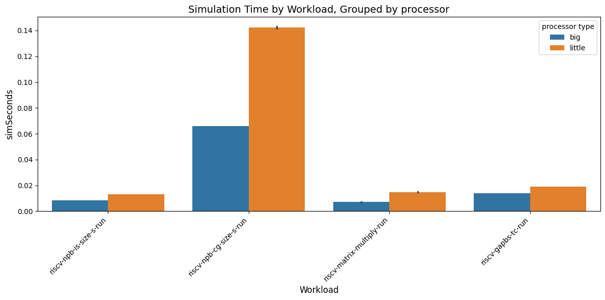

# Design Space Exploration

1 - **Performance Comparison**

We tested the big and little core configurations in some of the benchmark workloads. We inittialy set an L1 Cache of 32KB and 1GB MultiChannelLPDDR5.

The Big core processor has better performance as it has a lower simulated time in each workload and increased average IPC across the simulations.

To see if we can improve the performance, we increased the L1 cache size to 64KB and the memory to 4GB.

We can notice that we just gain a small IPC increase across the workloads. When looking at the simulated time of the workloads also note a small difference. Overall the big and little processor keep having a performance difference.

2 - Comparing Caches with different Replacement Policies

We want to compare the performance of the default `LRU` to the `MRU`replacement policy.

- LRU: It most likely evicts older entries
- MRU: It most likely evicts newer entries

Comparing the different policies across workloads on both little and big processors shows that the default LRU consistently performs better. The **MRU** policy yields the worst performance. The performance gap is most noticeable with the little processors, particularly during demanding workloads.

To determine whether the performance difference stems from the replacement policies, we calculated the average hit ratio for each policy to see if lower hit ratios correspond with decreased performance.

As expected the LRU, has a higher hit ratio than the others. We can see that LRU hit ratio is more consistent across the workloads (it has a standard deviation if `0.024732`, while MRU has more variance (std of `0.174952`).

3 -    Conclusion

Across the experiments we saw that the big core processor keeps outperforming the little core on each configuration adjustment. In the tested workloads increasing the memory and cache size or replacing did not bring and improvement, in fact changing the replacement policy to `MRU` brought a lower performance across the configurations.
